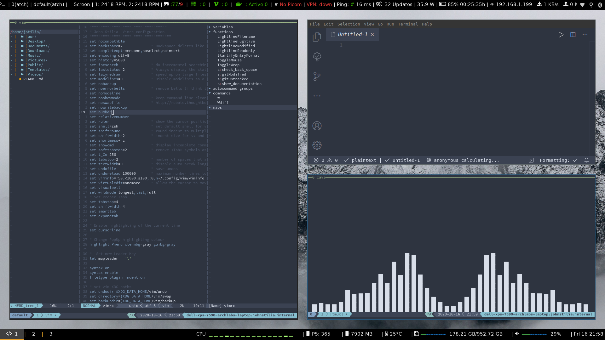

<h1 align="center">dotfiles ❤ ~/</h1



<p align="center">
    <a href="#vanila">Vanila Installl</a>&nbsp;&nbsp;&nbsp;
</p>

# <a name="vanila"></a>Install it on vanila system

```
git clone --bare git@github.com:stiliajohny/dotfiles.git $HOME/.cfg
```

```
function config {
   /usr/bin/git --git-dir=$HOME/.cfg/ --work-tree=$HOME $@
}
```

```
mkdir -p .config-backup
```

```
config checkout
```

```
if [ $? = 0 ]; then
  echo "Checked out config.";
else
  echo "Backing up pre-existing dot files.";
  config checkout 2>&1 | egrep "\s+\." | awk {'print $1'} | xargs -I{} mv {} .config-backup/{}
fi;
```

```
config checkout
```

```
config config status.showUntrackedFiles no
```


# Manual steps to automate later 

- `git clone https://github.com/zsh-users/zsh-history-substring-search ${ZSH_CUSTOM:-~/.oh-my-zsh/custom}/plugins/zsh-history-substring-search`
- `git clone https://github.com/zsh-users/zsh-autosuggestions ${ZSH_CUSTOM:-~/.oh-my-zsh/custom}/plugins/zsh-autosuggestions`
- `git clone https://github.com/chrissicool/zsh-256color ${ZSH_CUSTOM:-~/.oh-my-zsh/custom}/plugins/zsh-256color`
- `git clone https://github.com/sobolevn/wakatime-zsh-plugin.git ${ZSH_CUSTOM:-~/.oh-my-zsh/custom}/plugins/wakatime`
- `git clone https://github.com/zsh-users/zsh-completions ${ZSH_CUSTOM:-${ZSH:-~/.oh-my-zsh}/custom}/plugins/zsh-completions`
